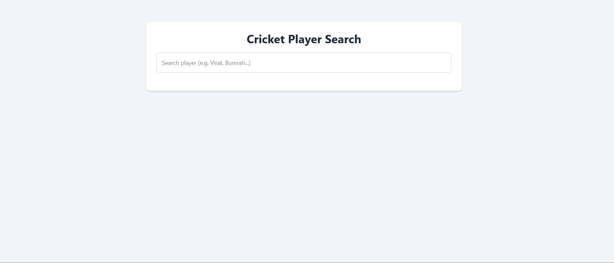
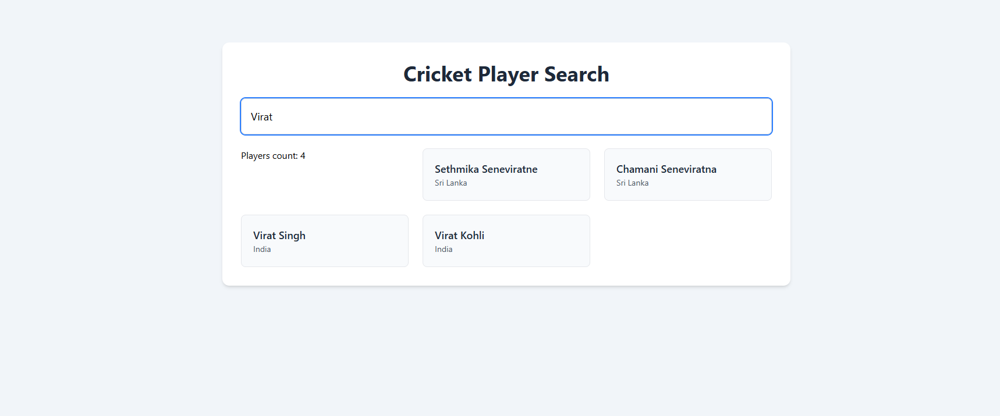
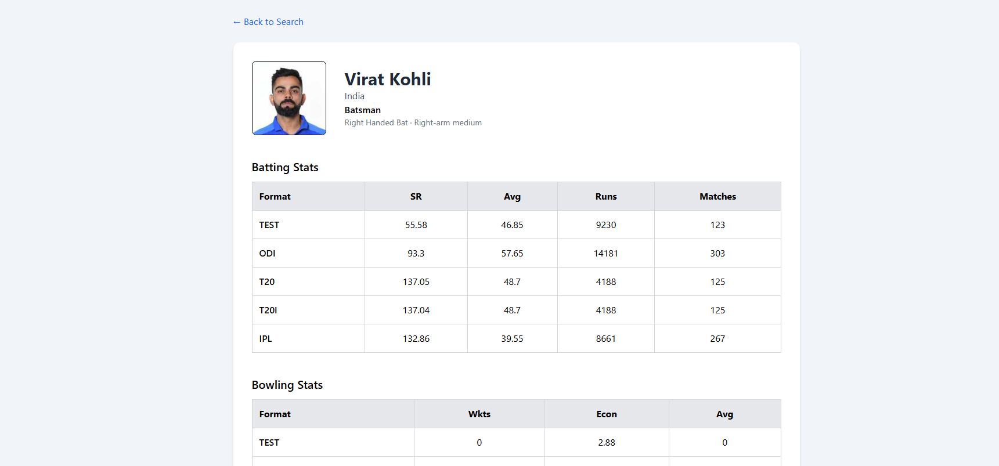
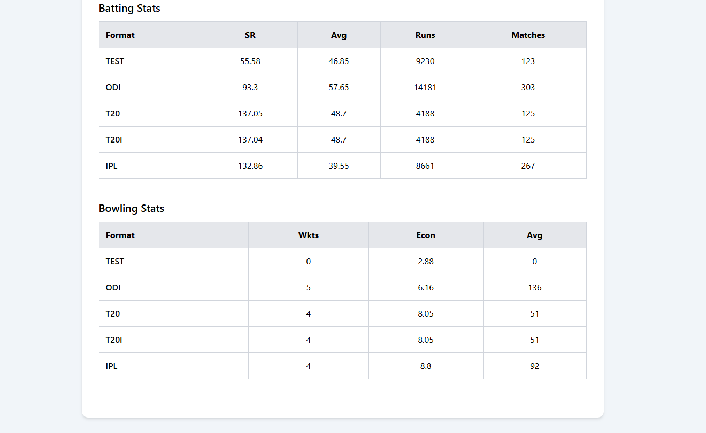

# 🏏 Cricket Player Stats App

A full-stack cricket player search and stats application built with **NestJS**, **React**, and **TypeScript**, using the **CricAPI** as the external data source.

The project focuses on clean architecture, API efficiency (rate-limit aware design), and a modern UI built with **Tailwind CSS v4**.

---

## ✨ Features

- 🔍 Search cricket players by name
- 👤 View detailed player profile
- 📊 Batting & bowling stats by format (Test / ODI / T20 / IPL)
- ⚡ Backend caching to minimize external API calls
- 🎨 Modern, responsive UI with Tailwind
- 🧭 SPA navigation using React Router

---

## 🧱 Tech Stack

### Backend
- **NestJS**
- **TypeScript**
- **Axios**
- **In-memory cache (pluggable with Redis)**
- **CricAPI (external stats provider)**

### Frontend
- **React (Vite)**
- **TypeScript**
- **Tailwind CSS v4**
- **Axios**
- **React Router**

---

## 🏗️ Architecture Overview

Frontend (React)
|
| /players/search?query=
| /players/:id
v
Backend (NestJS)
|
|-- In-memory cache (TTL based)
|-- Normalization layer
v

### Key design goals
- Avoid unnecessary external API calls
- Normalize inconsistent stats format
- Keep frontend simple and API-driven

---

## 🚦 Rate-Limit & API Usage Strategy

CricAPI free tier allows **100 requests/day**, so the backend is designed to be **API-efficient**:

### Current protections
- ✅ Search results cached by query
- ✅ Player details cached by player ID
- ✅ TTL-based cache (safe for cricket stats)

### Planned enhancements
- 🔒 Backend rate-limiting using NestJS Throttler
- 🧠 Redis cache (drop-in replacement for in-memory)
- ⛔ External API call guard when daily limit is reached

> The frontend never talks to CricAPI directly — all protection happens server-side.

---

## 📸 Screenshots

- Player search page
- Player details with stats table

---

## 🧪 Testing (Planned)

- Unit tests for services (Jest)
- Controller tests with mocked external API
- CI pipeline enforcement

---

## 🚀 CI/CD & Deployment (Planned)

- GitHub Actions for:
  - install
  - lint
  - test
  - build
- Dockerized services
- Deployment to:
  - DigitalOcean / AWS
- Infrastructure provisioning using **Terraform**

---

## 🛣️ Roadmap

- [ ] Backend unit & integration tests
- [ ] Rate-limiting middleware
- [ ] Redis integration
- [ ] Authentication (JWT → OAuth)
- [ ] CI/CD pipeline
- [ ] Cloud deployment
- [ ] Terraform IaC

---

## 🧑‍💻 Author

Built as a learning + portfolio project to explore:
- API-first design
- rate-limit aware architectures
- modern React + Tailwind workflows
